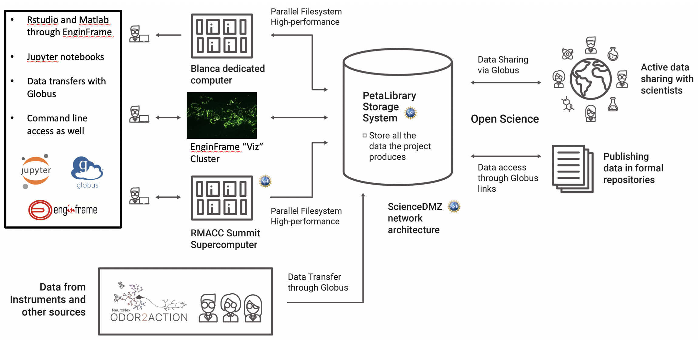

CURC documentation for Odor2Action users
=========================================
 
Welcome to the CU Boulder Research Computing (CURC) documentation for users affiliated with the Odor2Action project. CURC provides high performance computing and storage for Odor2Action.  

The objective of this documentation is to help you get started using CURC resources. Recognizig that each user has unique needs, in addition to using this documentation we strongly encourage you to contact rc-help@colorado.edu to request a one-on-one Zoom consulation. Consultations are an efficient way to quickly spin-up on use of CURC resources.  We want you to have a great experience!

----

The following schematic may be useful for visualizing CURC resources:

**Resources**: The following computing and storage resources are available to O2A users:

1. The dedicated O2A compute node on the `Blanca condo cluster <https://www.colorado.edu/rc/resources/blanca>`_ (most computing tasks) 
2. Shared computing nodes on the `RMACC Summit supercomputer <https://www.colorado.edu/rc/resources/summit>`_ (very big computing tasks)
3. The `CURC EnginFrame ("Viz") cluster <https://www.colorado.edu/rc/resources/enginframe>`_ (A 3d-accelerated remote deskotp environment on GPU nodes for visualizing images & using software requiring a graphical user interface, or "GUI")
4. The `CURC PetaLibrary <https://www.colorado.edu/rc/resources/petalibrary>`_ (storage of O2A datasets)

**Gateways**: The computing and storage resources can be accessed through the following gateways:

1. Via the command line (Access to Blanca or Summit for batch computing, or PetaLibrary for data transfer)
2. Via the `CURC JupyterHub <https://www.colorado.edu/rc/resources/jupyterhub>`_ (Access to Blanca or Summit to run iPython notebooks)
3. Via `CURC EnginFrame <https://www.colorado.edu/rc/resources/enginframe>`_ (Access to the Visualization cluster)
4. Via `Globus <https://www.globus.org>`_ (transfer files to/from PetaLibrary or other CURC filesystems)

See the `Quick Start Guide <main/index.html#span-style-color-green-quick-start-guide-span>`_ to get a CURC account and request access to resources.

----

.. toctree::
   :hidden:
   :maxdepth: 1

   HOME <self>  

.. toctree::
   :maxdepth: -1
   
   main/index

