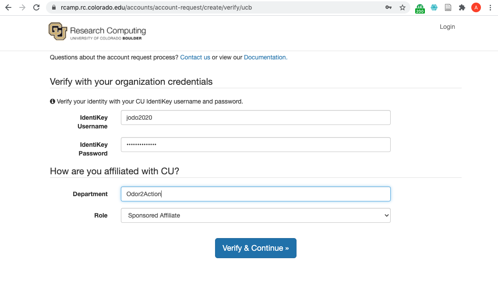
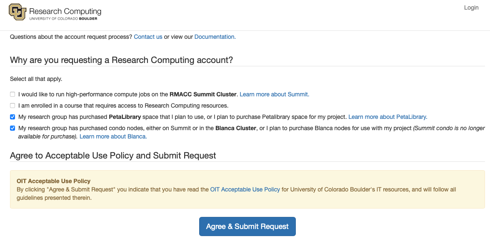
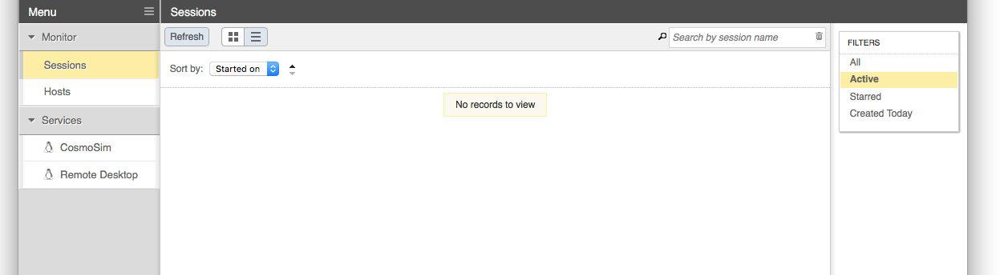
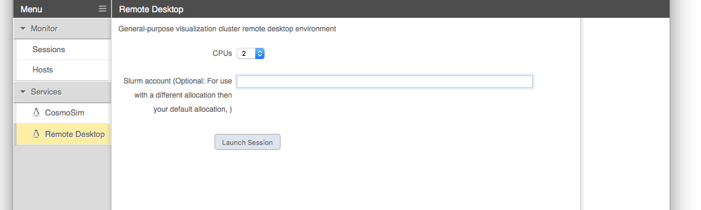
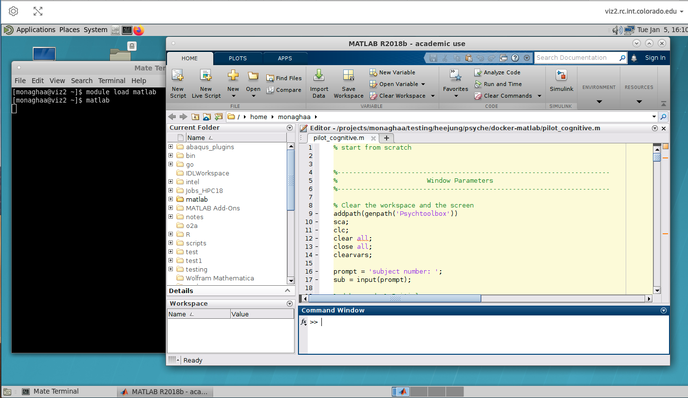

# QUICK START GUIDE

## Step 1: Getting a CU Identikey

___What?___ An IdentiKey consists of a CU Boulder username and associated password. The CU O2A personnel will sponsor non-CU O2A affiliates so that they can obtain an IdentiKey. 

___Why?___ An IdentiKey enables users to access CU services, including CURC resources.

___How?___ Non-CU O2A affiliates may request an IdentiKey by emailing the O2A PM [Kathryn.Cochran@colorado.edu](mailto:Kathryn.Cochran@colorado.edu) with the following information:
* Full legal name of individual to be sponsored**
* Birth date**
* Gender**
* A personal email address (CUIdM uses this email address for account claiming)

___How long will it take?___ The IdentiKey provisioning process usually takes a couple of days; please plan ahead.

_** This information is required by CU's Office of Information Technology (OIT) and is used to determine if an account already exists.  Additional information can be found on the CU OIT [Sponsored Affiliates pages](https://oit.colorado.edu/identikey-accounts/sponsored)_

## Step 2: Getting a CURC Account

___What?___ A CURC account consists of a username and password that will be identical to your IdentiKey username and password.

___Why?___ A CURC account enables access to CURC resources and also ensures you have your own user directories on CURC systems.

___How?___ Once you have obtained a CU IdentiKey, complete the following steps:

1. You will have received an official CU Email address, usually `<IdentiKey>@colorado.edu`. For example, if your IdentiKey is `jodo2020` your CU email address will be `jodo2020@colorado.edu`. __You can access this email via [Gmail](https://www.gmail.com).__ Please make sure you either 1) check this email regularly or 2) forward email from this address to your personal email address. This is important because CURC account correspondence will go to your `<IdentiKey>@colorado.edu` address. 

2. Now navigate to the [CURC accounts management portal](https://rcamp.rc.colorado.edu/accounts/account-request/create/verify/ucb). 

__You will come to the following screen:__


 
_Do the following:_
* enter your IdentiKey username and password where prompted.
* enter "Odor2Action" for your _Department_
* choose "Sponsored Affiliate" for your _Role_
* click on `Verify and Continue`.

__You will now come to a screen asking why you are requesting an account:__



_Do the following:_
* check the box for "My research group has purchased PetaLibrary space..."
* check the box for "My research group has purchased condo nodes..."
* click on `Agree & Submit Reqest`

__If your account request is successful, you'll see the following screen:__ 


You will receive an email to your `<IdentiKey>@colorado.edu` email address when your account has been provisioned. 

___How long will it take?___ Accounts are generally approved and provisioned within 1-2 hours during M-F business hours. After hours or weekend requests may not be provisioned until the next business day.

## Step 3: Setting up Duo 2-Factor Authentication

___What?___ In addition to your IdentiKey password, logging into CURC resources requires a "second factor" for authentication; this is similar to the text message you may receive on your phone when you enter a password to log into a bank account. CURC uses a 2-factor authentication service called "Duo". 

___Why?___ Two-factor authentication enhances the security of CURC systems by ensuring the user is you.

___How?___ You will receive a message to your `<IdentiKey>@colorado.edu` email address noting that your Duo account has been established.  Momentarily, you will receive a second email, an invitation from Duo.  Follow the instructions in the Duo invitation to install the Duo app on your phone and link your CURC account. 

_Additional information can be found in the [CURC Duo documentation](https://curc.readthedocs.io/en/latest/access/duo-2-factor-authentication.html)._

___How long will it take?___ Duo accounts are usually provisioned when your CURC account is established (Step 2 above). It will take 5 minutes or less to set up the Duo app on your smartphone and link it to your account.  

## Step 4: Request access to O2A resources

___What?___ Now that you have a CU Reserch Computing account, you'll need to request access to specific storage, computing and vizualization resources. 

___Why?___ Having access the O2A PetaLibrary allocation (where O2A datasets are stored), the O2A Blanca node and Summit nodes (computing), as well as EnginFrame (use of graphical software interfaces for Matlab, etc.) will enable you to work with O2A data.  

___How?___ Email [rc-help@colorado.edu](mailto:rc-help@colorado.edu), and cc the O2A PM [Kathryn.Cochran@colorado.edu](mailto:Kathryn.Cochran@colorado.edu) with the following text:

```
Hello CURC,

I am an Odor2Action user of CURC resources.  May I please be added to the following:

1. crimaldigrp 
2. blanca-o2a account
3. ucb-general account
4. Engineframe cluster
```

___How long will it take?___ Such requests are generally fulfilled within 1-2 hours during M-F business hours. After hours or weekend requests may not be provisioned until the next business day.

Now that you have completed the Quick Start Guide for onboarding, you can [learn how to access CURC resources](#accessing-curc-resources)!

# USING CURC RESOURCES

After completing Steps 1-3 above you will be able to login to CURC systems via a variety of _gateways_ depending on the resources you wish to access. Each gateway is described below. 

## Globus (upload/download data)

The O2A project has an allocation on <a href="https://www.colorado.edu/rc/resources/petalibrary" target="_blank">CURC PetaLibrary</a>, which is CURC's data storage and sharing platform. While there are numerous ways to transfer files to/from PetaLibrary, <a href="https://www.globus.org" target="_blank">Globus</a> is the recommended means of doing so. Users who prefer using command line methods for file transfers (e.g., _scp_, _sftp_ or _rsync_) may refer to the <a href="https://curc.readthedocs.io/en/latest/compute/data-transfer.html" target="_blank">CURC data transfer documentation</a>.

Globus is a web-based service that enables quick and intuitive data transfer and sharing between _endpoints_. Globus addresses deficiencies in secure copy requests by automating large data transfers, resuming failed transfers, and simplifying the implementation of high performance transfers between computing centers. An "endpoint" is a Globus term referring to one of the two file transfer locations – either the source or the destination – between which files can move. Once a resource (server, cluster, storage system, laptop, or other system) is defined as an endpoint, it will be available to authorized users who can transfer files to or from this endpoint.

### Using Globus to Transfer Files

<a href="https://app.globus.org" target="_blank">Sign into Globus</a> by
selecting "University of Colorado at Boulder" from the dropdown menu
and by logging in using your CU IdentiKey and password.


Files can easily be transferred to/from PetaLibrary or other CURC filesystems, from/to your local computer with Globus.

* _Step 1_: A Globus endpoint has already been established to connect you to CURC. You can connect to this endpoint by clicking the "Collection" field and searching for the endpoint: `CU Boulder Research Computing`. Log into the end point with your CU IdentiKey and password.

* _Step 2_: Your local computer must also have an Globus endpoint. Once logged into Globus (see above) you can do this by clicking on _"Endpoint"_ in the blue vertical menu bar on the left side of the screen. This will take you to the _Endpoints_ screen, and from here you can click on _"Create a personal endpoint"_ near the top of the screen and follow the steps provided.  Alternatiely, if you are not logged in to Globus you can navigate to the <a href="https://www.globus.org/globus-connect-personal" target="_blank">Globus Connect Personal</a> webpage and follow the steps provided to install a personal endpoint on your local machine. You'll be prompted to name the endpoint. Choose something intuitive and unique like _"John Doe's Macbook Pro"_.

* _Step 3_: Once you have established your local endpoint, go back to <a href="https://app.globus.org" target="_blank">Globus</a> in your browser and connect your local workstation endpoint on the other half of the Globus "File Manager" screen (you can search for the name you gave your endpoint in the "Collection" field). Now you can transfer files between your local machine and CURC.   


You can now use the "Path" field to navigate to the O2A PetaLibrary allocation. Type `/pl/active/odor2action` in the "Path" field, and then you can use your mouse to navigate deeper into the O2A allocation if needed.

> **_NOTE:_** _It is recommended that you only initiate one active Globus data transfer to a given subdirectory in PetaLibrary at a time.  Running multiple active transfers to the same subdirectory simultaneously may result in a failed transfer._ 


### Sharing data with Globus Shared Endpoints
With Globus you can share files with users outside of CU who do not have CURC accounts by creating shared endpoints. You can share any file/folder that you have access to.  The user you are sharing with must have a Globus account (these are freely available to anyone).

To setup a shared endpoint contact the O2A Project Manager at [Kathryn.Cochran@colorado.edu](mailto:Kathryn.Cochran@colorado.edu). 

## JupyterHub (python notebooks)

<a href="https://jupyter.org/"  target="_blank">Jupyter notebooks</a> are an excellent resource for interactive development and data analysis using _Python_, _R_, and other languages. Jupyter notebooks can contain live code, equations, visualizations, and explanatory text which provide an integrated enviornment to use, learn, and teach interactive data analysis.  

CU Research Computing (CURC) operates a <a href="https://jupyterhub.readthedocs.org/en/latest/" target="_blank">JupyterHub server</a> that enables users to run Jupyter notebooks on Summit or Blanca for serial (single core) and shared-memory parallel (single node) workflows. The CURC JupyterHub uses the <a href="https://jupyterlab.readthedocs.io" target="_blank">JupyterLab</a> user interface. The CURC JupyterHub runs atop of <a href="http://anaconda.com" target="_blank">Anaconda</a>.  Additional documentation on the <a href="https://curc.readthedocs.io/en/latest/software/python.html" target="_blank">CURC Anaconda distribution</a> is available and may be a good pre-requisite for the following documentation outlining use of the CURC JupyterHub.

### Step 1: Log  in to CURC JupyterHub

CURC JupyterHub is available at <a href="https://jupyter.rc.colorado.edu" target="_blank">https://jupyter.rc.colorado.edu</a>. To log in use your RC credentials. If you do not have an RC account, please <a href="https://rcamp.rc.colorado.edu/accounts/account-request/create/organization" target="_blank">request an account before continuing</a>.

### Step 2: Start a notebook server

To start a notebook server, select the `Summit interactive (12hr)` option in the *Select job profile* menu under *Spawner Options* and click *Spawn*. 

The server will take a few moments to start.  When it does, you will be taken to the Jupyter home screen, which will show the contents of your CURC `/home` directory in the left menu bar. In the main work area on the right hand side you will see the "Launcher" and any other tabs you may have open from previous sessions.

<p align="middle">
  
</p>

### Step 3: Navigating the JupyterLab Interface

The following features are available in the <a href="https://jupyterlab.readthedocs.io/en/stable/user/interface.html" target="_blank">Jupyterlab interface</a>:

* _Left sidebar:_ Click on a tab to change what you see in the left menu bar.  Options include the file browser, a list of running kernels and terminals, a command palette, a notebook cell tools inspector, and a tabs list.
* _Left menu bar:_ 
  * The _file browser_ will be active when you log in. 
    * You can navigate to your other CURC directories by clicking the folder next to `/home/<username>`. Your other CURC file systems are available too: `/projects/<username>`, `/pl/active` (for users with PetaLibrary allocations), `/scratch/summit/<username>` (Summit only), and `/rc_scratch/<username>` (Blanca only).
    * To open an existing notebook, just click on the notebook name in the file browser (e.g., _mynotebook.ipynb_).
    * Above your working directory contents are buttons to add a new Launcher, create a new folder, upload files from your local computer, and refresh the working directory. 
* _Main Work Area:_ Your workspaces will be in this large area on the right hand side. Under the "Launcher" tab you can: 
  * Open a new notebook with any of the kernels listed:
      * __Python 3 (idp)__: Python3 notebook (Intel Python distribution)
      * __Bash__: BASH notebook
      * __R__: R notebook 
      * ...and any other custom kernels you add on your own _(see our main documentation for details on 
<a href="https://curc.readthedocs.io/en/latest/gateways/jupyterhub.html#creating-your-own-custom-jupyter-kernels" target="_blank">creating your own custom kernels</a>)._
   * Open a new console (command line) for any of the kernels.
   * Open other functions; the "Terminal" function is particularly useful, as it enables you to access the command line on the Summit or Blanca node your Jupyterhub job is currently running on. 
* See Jupyter's <a href="https://jupyterlab.readthedocs.io/en/stable/user/interface.html" target="_blank">documentation on the JupyterLab interface for additional information</a>.

#### Tip for finding the packages available to you within a notebook

The ___Python 3___ notebook kernel has many preinstalled packages. To query a list of available packages from a python notebook, you can use the following nomenclature:

```
from pip._internal import main as pipmain 
pipmain(['freeze'])
```

If the packages you need are not available, [you can create your own custom environment and Jupyter kernel](#additional-documentation).

    
#### For users who prefer the "old school" classic Jupyter interface in favor of JupyterLab

You can access the Jupyter classic view by going to the address bar at the top of your broswer and changing "lab" to "tree" in the URL.  For, example, if your session URL is `https://jupyter.rc.colorado.edu/user/janedoe/lab`, you can change this to `https://jupyter.rc.colorado.edu/user/janedoe/tree`. 

### Step 4: Shut down a Notebook Server

When you are finished, go to the "File" menu at the top and choose "Hub Control Panel". Use the `Stop My Server` button in the `Control Panel` to shut down the Jupyter notebook server when finished (this cancels the job you are running on Blanca). You also have the option to restart a server if desired.

Alternately, you can use the `Quit` button from the Jupyter home page to shut down the Jupyter notebook server.

Using the `Logout` button will log you out of CURC JupyterHub.  It will not shut down your notebook server if one happens to be running.  

### Additional Documentation

Users frequently need to build custom Anaconda environments that contain specific packages they need. The topics below will help you create your own environment and enable it for use in CURC JupyterHub.
- <a href="https://curc.readthedocs.io/en/latest/software/python.html#create-your-own-custom-environment" target="_blank">Create your own custom conda environment using the CURC Anaconda distribution</a>
- <a href="https://curc.readthedocs.io/en/latest/gateways/jupyterhub.html#creating-your-own-custom-jupyter-kernels" target="_blank">Create a Jupyter kernel to enable use of your custom conda environment in CURC JupyterHub</a>

## EnginFrame (visualization, GUIs)

NICE EnginFrame provides a 3d-accelerated remote desktop environment on an Nvidia GPU-equipped compute node. Coupled with the proprietary Desktop Cloud Visualization (DCV) VNC server, the EnginFrame service supports the use of common visualization applications in a typical desktop environment via your web browser.


### Step 1: Login to EnginFrame

> **_NOTE 1:_** _You'll need to be on the CU Virtual Private Network (VPN) to use EnginFrame. If you already have a VPN client on your machine you can connect to `vpn.colorado.edu` through that (login credentials are your CU IdentiKey and password). If you don't have a VPN client on your machine, you can <a href="https://oit.colorado.edu/services/network-internet-services/vpn/help" target="_blank">download one from the CU Office of Information Technology</a>._ 

> **_NOTE 2:_** _You should have previously received access to EnginFrame when you [requested access to O2A resources](#step-4-request-access-to-o2a-resources). However, if you find you cannot login per the documentation below, please email [rc-help@colorado.edu](mailto:rc-help@colorado.edu) to request access._

In your web browser, navigate to the CURC EnginFrame instance at
<a href="https://viz.rc.colorado.edu" target="_blank">https://viz.rc.colorado.edu</a>.

From the welcome page, select "Views" from the available interfaces (or use <a href="https://viz.rc.colorado.edu/enginframe/vdi/vdi.xml" target="_blank">this direct link</a>).


Provide your RC login credentials at the login prompt. You will be
promted to use a second authentication factor (e.g., the Duo mobile
app) to log in.


### Step 2: Starting a remote desktop

After logging in, you'll see some "Remote Desktop" options in the list of services in
the left sidebar. Choose the opton for the "Nvidia Quadro RTX 8000".



When starting a Remote Desktop session you may customize the resources allocated to the session and other characteristics of the dispatched Slurm job. In most cases the defaults will be adequate (i.e, no need to specify an account, nodelist or reservation). 



Once the session has started, a thumbnail of the running session appears in the Sessions list. EnginFrame will attempt to open the session automatically, but may be blocked by the browser. In that case, simply select the session thumbnail from the list, or use the "click here" link in the notification text.


### Step 3: Use graphical software

With the Remote Desktop session running and open, you should be able to run standard Linux desktop applications that have a graphical user interface (GUI). A commonly-used example would be Matlab. To start the Matlab GUI, do the following:

1. Open a terminal by clicking `Applications`-->`System Tools`-->`MATE Terminal`
2. Load the Matlab software and start Matlab by typing:

```bash
module load matlab/2019b
matlab
```



### Additional Resources

- <a href="https://www.nice-software.com/products/enginframe" target="_blank">https://www.nice-software.com/products/enginframe</a>
- <a href="https://www.nice-software.com/products/dcv" target="_blank">https://www.nice-software.com/products/dcv</a>


## O2A Blanca compute node (command line, batch computing)

For users with intensive computing needs that cannot be met by EngineFrame or JupyterHub, the O2A project has also purchased a compute node within the <a href="https://www.colorado.edu/rc/resources/blanca" target="_blank">CURC Blanca cluster</a>.  Blanca will be familiar to users accustomed to using linux-based high-performance computing resources. Blanca has about 200 compute nodes, each with between 16-40 cores.  Blanca may be useful for workflows comprised of 100s to 1000s of computing tasks (e.g., processing images), for running software that requires multiple cores ("parallelization"), or for running long, unattended computing tasks (up to 7 days). O2A users will have priority access to the Blanca O2A node, and preemptable access to the other ~200 nodes on Blanca. The Blanca cluster uses the <a href="https://slurm.schedmd.com/documentation.html" target="_blank">Slurm</a> workload manager to schedule computing "jobs" on available resources among hundreds of users. CURC personnel can help you establish a new workflow on Blanca; just email [rc-help@colorado.edu](mailto:rc-help@colorado.edu) to set up a Zoom consultation.    

### Logging in
#### Logging in from a Windows Machine

Logging in from a Windows machine requires the additional step of <a href="https://www.putty.org/" target="_blank">installing the PuTTY ssh client</a> onto your local machine. This application allows users to connect to remote servers with the ssh protocol. Note that there are other ssh clients that allow Windows machines to connect to remote ssh servers; Research Computing recommends PuTTY for reliability and simplicity.

1. Open the PuTTY application on your computer
    * Under “Host Name (or IP address)”, enter `login.rc.colorado.edu`. Select “SSH” as the connection type. Click on “Open”.
2. Enter your Identikey in response to the “login as” prompt
3. When prompted to enter your password:
    * If you are logging in using Duo Push, simply type your Identikey password. You will then receive an authentication request from the Duo app on your phone. Approve the request.
    * If you are using Duo SMS, Phone Call, or Token login methods, instructions can be <a href="https://curc.readthedocs.io/en/latest/access/duo-2-factor-authentication.html" target="_blank">found here</a>.
    * Note that as a security feature, PuTTY does not display any text while you type your password


#### Logging in from a Mac

Logging in with a Mac requires no extra installation on your local machine. Simply utilize the terminal application that is pre-installed with your operating system to access Research Computing resources. 

1. Under “File”, open a new finder window. Navigate to the “Applications” folder, then the “Utilities” folder. Open a terminal window and type `ssh username@login.rc.colorado.edu`, where `username` is your assigned username. Press enter.
2. Enter your password:
    * If you are logging in using Duo Push, type your Identikey password.  You will then receive an authentication request on the Duo app on your phone. Approve the request.
    * If you are using Duo SMS, Phone Call, or Token login methods, instructions can be <a href="https://curc.readthedocs.io/en/latest/access/duo-2-factor-authentication.html" target="_blank">found here</a>.

#### Logging in from Linux

Much like with Macs, Linux machines require no additional setup to access Research Computing resources. Simply utilize the your Linux terminal to access Research Computing resources. 

1. Open a terminal window from your application menu and type: `ssh username@login.rc.colorado.edu`, where `username` is your research computing username.

2. Enter your password:
    * If you are logging in using Duo Push, simply type your Identikey password. You will then receive an authentication request on the Duo app on your phone. Approve the request.
    * If you are using Duo SMS, Phone Call, or Token login methods, instructions can be <a href="https://curc.readthedocs.io/en/latest/access/duo-2-factor-authentication.html" target="_blank">found here</a>.

#### SSH host keys

The first time you log into an RC login node you will be asked to verify the host key. You can refer to the keys published here to confirm that you are connecting to a valid RC login node.

> **_NOTE:_** _Each login node may support more than one type of key, but only one is used (or displayed) by your client at any given time._

### Running jobs

Because CURC computing resources are shared among many researchers, Research Computing manages usage of the system through jobs. **Jobs** are simply an allotment of resources that can be used to execute processes. Research Computing uses a program named the *Simple Linux Utility for Resource Management*, or **Slurm**, to create and manage jobs.

In order to run a program on the O2A partition on Blanca, you must request resources from Slurm to generate a job. Resources can be requested from a login node or a compile node. You must then provide commands to run your program on those requested resources. Where you provide you commands depends on whether you are running a <a href="https://curc.readthedocs.io/en/latest/running-jobs/batch-jobs.html" target="_blank">batch job</a> or an <a href="https://curc.readthedocs.io/en/latest/running-jobs/interactive-jobs.html" target="_blank">interactive job</a>

When you submit a batch job or an interactive job, it will be placed in a queue until resources are available. Additional details can be found in the <a href="https://curc.readthedocs.io/en/latest/running-jobs/slurm-commands.html" target="_blank">documentation on Slurm queue and accounting tools</a>.

#### Batch Jobs

The primary method of running applications on Research Computing resources is through a batch job. A **batch job** is a job that runs on a compute node with little or no interaction with the users. You should use batch jobs for:

- Any computationally expensive application that could take hours or days to run
- Any application that requires little or no user input
- Applications that you do not need to monitor extensively

Unlike running an application on your personal machine, you do not call the application you wish to run directly. Instead you create a **job script** that includes a call to your application. Job scripts are simply a set of resource requests and commands. When a job script is submitted all the commands in the job script are executed on a compute node. 

Once you've created your job script it can be submitted to the Slurm queue with the `sbatch` command followed by your job script name:

```bash
module load slurm/blanca
sbatch <your-jobscript-name>
```

If no job script is provided then `sbatch` will take whatever commands follow as standard input.

For more advanced topics see our detailed guide on <a href="https://curc.readthedocs.io/en/latest/running-jobs/batch-jobs.html" target="_blank">constructing and submitting job scripts</a>.

Here's an example job script to get you started:

```bash
#!/bin/bash

#SBATCH --nodes=1
#SBATCH --time=0:01:00
#SBATCH --partition=blanca-o2a
#SBATCH --ntasks=1
#SBATCH --job-name=myfirstjob
#SBATCH --output=myfirstjob_%j.out

module purge

module load R/3.5.0

echo "hello world"
```


#### Interactive Jobs

Another method of running applications on Research Computing resources is through an interactive job. As the name would imply, an **interactive job** is a job that allows users to interact with requested resources in real time. Users can run applications, execute scripts, or run other commands directly on a compute node. Interactive jobs should be used for:

- Debugging applications or workflows
- Any application that requires user input at runtime
- Any application with a GUI (graphical user interface)

You can request an interactive job by using the `sinteractive`command. Unlike the `sbatch`, resources must be requested via the command line through the use of flags. Though running sinteractive without any flags is possible, this will result in default values being used for your jobs. Research Computing highly recommends you provide a `partition` and a `time` parameter to avoid long queue times or accidental overuse of your priority. 

```bash
module load slurm/blanca
sinteractive --partition=blanca-o2a --time=00:10:00
```

For additional details see our <a href="https://curc.readthedocs.io/en/latest/running-jobs/job-resources.html" target="_blank">list of sinteractive parameters</a>.

The example above will submit an interactive job that will run a terminal session on one core of one node with the Odor2Action partition (`blanca-o2a`) for ten minutes. Once the interactive session has started you can run any interactive terminal application you may need on the command line. 

Our main documentation has additional details <a href="https://curc.readthedocs.io/en/latest/running-jobs/interactive-jobs.html>on running Interactive jobs</a>.

# HOW DO I?...

## Use Matlab on CURC

### Overview

Research Computing (RC) provides a large suite of software on RC
resources. In this tutorial we will learn how to run Matlab on these
resources. The tutorial assumes you are familiar with Matlab and basic
Linux terminal commands.

There are two basic ways to run Matlab (or many other kinds of
software) on RC resources. The first is through an interactive job,
and the second is through a batch job. An interactive job allows one
to work in real-time with Matlab. Two reasons you may want to do this
would be if you are actively debugging your code, or if you would like
to use the graphical user interface (GUI -- in this instance, the Matlab Desktop). However, there
might be other reasons you would like to work interactively with
Matlab.

The second way to run Matlab on RC resources is by submission of a
batch job. This allows the job to run in the background when resources
become available. You may choose to use this method if you have a
large job that may wait in the queue for awhile, or if you are not
debugging or in need of a GUI. Both ways to work with Matlab are
below.

### Submitting Matlab Interactive Jobs

Running Matlab interactive jobs on RC resources is both a simple and
easy task to accomplish. Odor2Action users can run an interactive Matlab jobs using EnginFrame.  Documentation on starting an interactive session and launching Matlab can be found in the [Enginframe secion of this documentation](#enginframe-visualization-guis). Note that EnginFrame will be retired at the end of 2022.  
	
> **_NOTE:_** _CURC is developing a new, more functional service to replace EnginFrame called __Open Ondemand__. Although CURC is still developing features, this service can be accessed now. See <a href="https://viz.rc.colorado.edu" target="_blank">CURC Open OnDemand</a> for documentation._

### Submitting Matlab Batch Jobs

Here, we will learn how to run a Matlab script in a non-interactive
batch job. 

Let’s begin by constructing a small Matlab script that prints ‘hello
world’ to the user.  The Matlab script we will use for the purposes of
this tutorial is called `hello_world.m` and contains only one line,
the Matlab command:

```matlab
fprintf(‘Hello world\n’)
```

Which simply prints "Hello world" when called.

Next, we will construct our batch script that will enable us to submit
this job. The batch script organizes the variety of flags slurm needs
to submit a job and specifies the software commands we want to
execute. An advantage of batch scripts is that they are easily
reusable and adaptable for other similar tasks.

We will submit this job using a bash script titled: `slurm_hello.sh`,
which contains the following lines:

```bash
#!/bin/bash

#SBATCH --nodes=1
#SBATCH --time=0:01:00
#SBATCH --partition=blanca-o2a
#SBATCH --ntasks=1
#SBATCH --job-name=Matlab_Hello_World
#SBATCH --output=Matlab_Hello_World.out

module purge

module load matlab

matlab -nodesktop -nodisplay -r ‘clear; hello_world;’
```

This file has a few basic parts:

1. The first line specifies that it is a bash shell script, and
   ensures the rest of the lines will be interpreted in the correct
   shell.

2. The lines beginning with `#SBATCH` specify the Slurm parameters
   that will be used for this job. These lines are viewed as comments
   by bash, but will be read by Slurm. Of particular note is the
   `--output` parameter which specifies the file where stderr and
   stdout (including the output from our Matlab script) will be
   written. For a description of the Slurm parameters, [please see the <a href="https://slurm.schedmd.com/sbatch.html" target="_blank">general Slurm documentation</a>.

3. The lines beginning with `module purge` remove any unneeded
   software and ensure that the appropriate Matlab module is loaded on
   the compute node.

4. The final line calls Matlab and instructs it to run our
   script. This entire line includes commands that are specific to
   Matlab; the `nodesktop` and `nodisplay` flags ensure that the
   Matlab Desktop will not open, and the `r` flag will run the script
   `hello_world`. The `clear` command forces Matlab to clear any
   existing variables, and is simply included as good coding practice.

You have now completed your batch script. After saving the script and
exiting your text editor, submit the job as follows:

```bash
sbatch slurm_hello.sh
```

Once the job has run, the output of the Matlab script, "Hello world"
will be shown in `Matlab_Hello_World.out`.


### Parallel Matlab on Blanca

To fully utilize the multi-core capabilities of Blanca to speed up
jobs, most code must first be parallelized. Matlab has many built in
tools to accomplish this task. In this tutorial we will parallelize
our "Hello World" program.

Let’s begin with the Matlab script we created above called
`hello_world.m`. First we will modify the fprintf line so that it
includes a variable 'i' that will print out the iteration of the
parallel loop.

```matlab
fprintf(“Hello World from process %i”, i)
```

Next, we need to encapsulate the print statement in a parallel 'for'
loop. Matlab uses the construct parfor to separate the task into
multiple threads. In order to utilize the `parfor` command one must
ensure that the Parallel Computing Toolbox is available as part of the
Matlab software package. RC has this available and thus no additional
action is required on your part if you are utilizing RC resources.

The order of runtime in the loop is not guaranteed, so the output may
not be in sequential order. The loop is formatted as such:

```matlab
parfor(i = initial_Value:final_Value, maximum_amount_of_threads)
```

For example, let’s use parfor to implement an 5-iteration loop with a
maximum of 4 processors in our script (new lines are highlighted here
in blue):

```matlab
parfor(i = 1:5, 4)
        fprintf("Hello, World from process %i", i)
end
```

Now all we have left to do is modify our batch script to specify that
we want to run 4 tasks on the node. We can also change the name of the job and the
output file if we choose.

```bash
#!/bin/bash

#SBATCH --nodes=1
#SBATCH --time=0:01:00
#SBATCH --partition=blanca-o2a
#SBATCH --ntasks=4
#SBATCH --job-name=Matlab_Parallel_Hello
#SBATCH --output=Matlab_Parallel_Hello.out

module purge

module load matlab

matlab -nodesktop -nodisplay -r 'clear; hello_world;'
```

Now we submit the job using the `sbatch` command shown above, and our
output in `Matlab_Parallel_Hello.out` will be as follows (the process
order may be different in your output):

```
Hello World from process 4
Hello World from process 1
Hello World from process 2
Hello World from process 3
```

RC Matlab currently does not support parallelization across nodes,
only across cores on one node.

## Use a Jupyter Notebook on CURC

The CURC JupyterHub enables the use of Jupyter notebooks on CURC resources. To get started, follow the [documentation on using CURC JupyterHub](#jupyterhub-python-notebooks).

## Use Rstudio on CURC

It is possible to use Rstudio on the CURC JupyterHub. Interested users can follow the [documentation on using CURC JupyterHub](#jupyterhub-python-notebooks), but instead of selecting the `Summit interactive (12hr)` option they should choose the `Summit interactive Rstudio (12hr)` option in the *Select job profile* menu under *Spawner Options* and click *Spawn*. 

## Transfer files to or from CURC

The recommended method for transferring files to or from CURC is to use the Globus web-based service. To get started, follow the [documentation on using Globus](#using-globus-to-transfer-files)

Users who prefer using command line methods for file transfers (e.g., _scp_, _sftp_ or _rsync_) may refer to the <a href="https://curc.readthedocs.io/en/latest/compute/data-transfer.html" target="_blank">CURC data transfer documentation</a>

## Access the O2A Blanca node

To access the O2A Blanca node from a terminal on your laptop or desktop computer:

```bash
# first login:
$ ssh <IdentiKey>@login.rc.colorado.edu
# <type password and accept duo push to your phone to login>

# Now once you are on a CURC login node, load the slurm job manager for Blanca
$ module load slurm/blanca

# <now you can either start an interactive job or submit a batch job>.
# start an interactive job (e.g.,. for a 1 hour job with 2 cores on blanca-o2a):
$ sinteractive --time=01:00:00 --ntasks=2 --partition=blanca-o2a

# or submit a batch job (assumes you have previously written a job script called 'myjob.sh'):
$ sbatch myjob.sh
```

If you cannot submit jobs to the `blanca-o2a` partition, please email [rc-help@colorado.edu](mailto:rc-help@colorado.edu) and cc [Kathryn.Cochran@colorado.edu](mailto:Kathryn.Cochran@colorado.edu) and request to be added to `blanca-o2a`.
	
## Access a Summit node

Summit has 450 general compute nodes, each with 24 cores, and may be an alternative to the Blanca O2A partition if you have lots of work that requires additional computing resources. Summit will be retired near the end of 2022 or early 2023. To access a Summit node:

```bash
# first login:
$ ssh <IdentiKey>@login.rc.colorado.edu
# <type password and accept duo push to your phone to login>

# Now once you are on a CURC login node, load the slurm job manager for Summit
$ module load slurm/summit

# <now you can either start an interactive job or submit a batch job>.
# start an interactive job (e.g.,. for a 1 hour job with 2 cores on blanca-o2a):
$ sinteractive --time=01:00:00 --ntasks=2 --partition=shas

# or submit a batch job (assumes you have previously written a job script called 'myjob.sh' that has the "--partition=shas" flag):
$ sbatch myjob.sh
```

If you cannot submit jobs to the Summit `shas` partition, please email [rc-help@colorado.edu](mailto:rc-help@colorado.edu) and cc [Kathryn.Cochran@colorado.edu](mailto:Kathryn.Cochran@colorado.edu) and request to be added to `ucb-general` on Summit.
	
## Access an Alpine node

Alpine is CURC's newest supercomputer and will be available to all users beginning in late April 2022. Alpine Phase 1 has 64 general compute nodes, each with 64 cores, as well as 16 GPU nodes, each with 3 GPUs (a mix of NVIDIA A100 and AMD MI100). Alpine may be an alternative to the Blanca O2A partition if you have lots of work that requires additional computing resources. To access an Alpine node:

```bash
# first login:
$ ssh <IdentiKey>@login.rc.colorado.edu
# <type password and accept duo push to your phone to login>

# Now once you are on a CURC login node, load the slurm job manager for Alpine
$ module load slurm/alpine

# <now you can either start an interactive job or submit a batch job>.
# start an interactive job (e.g.,. for a 1 hour job with 2 cores on blanca-o2a):
$ sinteractive --time=01:00:00 --ntasks=2 --partition=amilan-ucb

# or submit a batch job (assumes you have previously written a job script called 'myjob.sh' that has the "--partition=amilan-ucb" flag):
$ sbatch myjob.sh
	
# note that "amilan-ucb" is the Alpine CPU partition. You can also schedule jobs to the gpu partitions by specifying "--partition=aa100-ucb" (NVIDIA A100 GPUs) or "--partition=ami100-ucb" (AMD MI100 GPUs). 
```

If you cannot submit jobs to the Alpine partitions, please email [rc-help@colorado.edu](mailto:rc-help@colorado.edu) and cc [Kathryn.Cochran@colorado.edu](mailto:Kathryn.Cochran@colorado.edu) and request to be added to `ucb-general` on Alpine.

## Check how much disk space I have

You have permanent personal storage space on two filesystems:
* `/home/<your_username>` (2 GB)
* `/projects/<your_username>` (250 GB)

To see how much space is consumed and available, you can use the `curc-quota` command from a login node:

```
[johndoe@login11 ~]$ curc-quota
------------------------------------------------------------------------
                                       Used         Avail    Quota Limit
------------------------------------------------------------------------
/home/johndoe                         1.8G          262M           2.0G
/projects/johndoe                     237G           14G           250G
```

> **_NOTE1:_** _After the results for your `/home/` and `/projects` directories are shown, you may also see some error messages suggesting you login to a Summit scompile node. These messages refer to filesystems on Summit which can't be queried from a login nodes. They can be ignored._
	
> **_NOTE2:_** _You also have large "scratch" spaces available on Blanca (`/rc_scratch/$USER`), Summit (`/scratch/summit/$USER`) and Alpine (`/scratch/alpine/$USER`).  These spaces can be used for file input/output during jobs.  Files on scratch spaces are purged 90 days after the date of creation, so make sure you copy any files you want to keep to a permanent space when finished, such as your `/projects/$USER` direcory or `/pl/active/o2a`._

## Access the O2A PetaLibrary allocation

The path to the O2A PetaLibrary allocation is `/pl/active/o2a`. You should be able to access this directory and its subdirectories by typing the full path from the command line, or (if using Globus), by typing the path into the "path" dialog box. If you encounter "permission denied" errors, it is likely you have not been added to the `odor2action` user group.  In this case, please email [rc-help@colorado.edu](mailto:rc-help@colorado.edu) and cc [Kathryn.Cochran@colorado.edu](mailto:Kathryn.Cochran@colorado.edu) and request to be added to `oder2action`

## Port Duo to my new phone

If you get a new phone you will need to add the new device to your Duo accouht. You can do so by visiting <a href="https://duo.colorado.edu">https://duo.colorado.edu</a>.
After a CU authorization page you will be directed to a Duo authentication page. **Ignore the Duo Push prompt and instead click "Settings":** 


In this settings side bar click "Add a new device.":


Duo will then try to authenticate your account by push notification to verify your identity. Cancel this push notifcation...  

<!-- insert image here  -->

...and click on "Enter a Passcode", or "Call Me". 
- If you select "Call Me" the simply recieve the call and press 1. 
- If you select "Enter a passcode" then click "Text me new codes" and you will be sent a list of one time passwords. Type in any one of the codes and you will be authenticated. 
Once you have verified your identity, follow the instructions provided by Duo to add your device.

If you cannot authenticate your account, contact [rc-help@colorado.edu](mailto:rc-help@colorado.edu) for further assistance.

# GLOSSARY

### <a href="https://oit.colorado.edu/services/identity-access-management/identikey" target="_blank">IdentiKey</a>
_An IdentiKey consists of a CU Boulder username and an IdentiKey password. An IdentiKey is the credential that uniquely identifies you to online services and campus computing facilities so that they may grant you access._

### <a href="https://www.colorado.edu/rc/resources/summit" target="_blank">RMACC Summit</a>
_An NSF-funded supercomputer operated by CURC and freely available to CU users and affiliates. Summit will retire in late 2022 or early 2023._
	
### <a href="https://curc.readthedocs.io/en/latest/clusters/alpine.html" target="_blank">Alpine</a>
_A colloboratively-funded supercomputer operated by CURC and freely available to CU users and affiliates. Alpine replaces Summit and will be available to users in April 2022._

### <a href="https://www.colorado.edu/rc/resources/blanca" target="_blank">Blanca</a>
_The CURC condo computing service "Blanca" offers researchers the opportunity to purchase and own compute nodes that will be operated as part of a shared cluster. The aggregate cluster is made available to all condo partners while maintaining priority for the owner of each node. Odor2Action owns a Blanca node for use by O2A affiliates._

### <a href="https://www.colorado.edu/rc/resources/petalibrary" target="_blank">PetaLibrary</a>
_A CURC service that enables the storage, archival, and sharing of research data. It is available at a subsidized cost to any researcher affiliated with the University of Colorado Boulder. The Odor2Action project owns a PetaLibrary allocation for use by O2A affiliates._

### <a href="https://www.globus.org" target="_blank">Globus</a>
_A web-based service that enables quick and intuitive data transfer and sharing between endpoints._

### <a href="https://docs.globus.org/faq/globus-connect-endpoints/#what_is_an_endpoint" target="_blank">Endpoint</a>
_An "endpoint" is a Globus term referring to one of the two file transfer locations – either the source or the destination – between which files can move. Once a resource (server, cluster, storage system, laptop, or other system) is defined as an endpoint, it will be available to authorized users who can transfer files to or from this endpoint._

### <a href="https://www.colorado.edu/rc/resources/enginframe" target="_blank">EnginFrame cluster</a>

_The CURC EnginFrame cluster provides a 3d-accelerated remote desktop environment on an Nvidia GPU-equipped compute node hosted by CURC. Coupled with the proprietary Desktop Cloud Visualization (DCV) VNC server, the CURC EnginFrame supports the use of common visualization applications in a typical desktop environment (e.g. Matlab, Rstudio) using only a web browser. EnginFrame will retire at the end of 2022 and will be replaced by Open OnDemand (see below)._

### <a href="https://viz.rc.colorado.edu" target="_blank">CURC Open OnDemand</a>

_The CURC Open OnDemand gateway provides a web-browser-based portal to numerous CURC services.  Within Open OnDemand, users can open a terminal, schedule jobs, use Jupyter Notebooks, run the Matlab GUI, and start a 3d-accelerated remote desktop environment on an Nvidia GPU-equipped compute node hosted by CURC. CURC Open OnDemand will replace CURC EnginFrame at the end of 2022._
	

### <a href="https://www.colorado.edu/rc/resources/jupyterhub" target="_blank">JupyterHub</a>
_JupyterHub is a multi-user server for Jupyter (formerly known as IPython) notebooks. It provides a web service that allows you to create and share documents that contain live code, equations, visualizations and explanatory text. CURC hosts a JupyterHub environment that enables researchers to utilize CURC-hosted storage and computing resources._
	

### <a href="https://curc.readthedocs.io/en/latest/cloud/cumulus.html" target="_blank">CUmulus cloud system</a>
_CUmulus is an on-premise cloud resource that "looks" a lot like Amazon Web Services. It facilitates projects that don't map easily to HPC, such as running persistent processes or databases._

# GETTING HELP

## User support for CURC resources
* contact [rc-help@colorado.edu](mailto:rc-help@colorado.edu)
	* _note that in addition to email correspondence, we will gladly do Zoom consultations on request to help you get started, provide workflow assistance, or troubleshoot issues_

## CURC main documentation
* [https://curc.readthedocs.io](https://curc.readthedocs.io)

## CURC status page (service alerts)
* [https://curc.statuspage.io](https://curc.statuspage.io) _Note: at this link you can sign up to receive service alerts by email. We highly recommend doing so in order to be notified of service interruptions._

## Odor2Action questions
* contact [Kathryn.Cochran@colorado.edu](mailto:Kathryn.Cochran@colorado.edu) 

