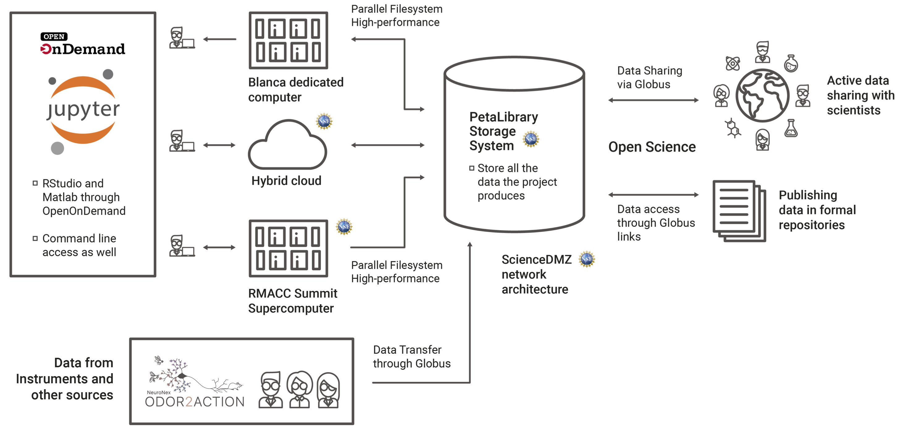

# <span style="color:green">INTRODUCTION</span>

## Overview





```
code block here
```

`flag here`

# <span style="color:green">QUICK START GUIDE</span>

## Step 1: Getting a CU Identikey

## Step 2: Getting a CU Research Computing Account

## Step 3: Requesting Access to the Odor2Action Resources

## Step 4: Setting up Duo 2-Factor Authentication

## Step 5: Accessing CURC Resources

### Accessing PetaLibrary (file transfer)

### Accessing JupyterHub (python notebooks)

### Accessibg EnginFrame (Matlab GUI, visualization)

### Accessing the O2A Blanca node (command line, batch computing)

# <span style="color:green">OTHER TOPICS</span>

# <span style="color:green">FAQ</span>

